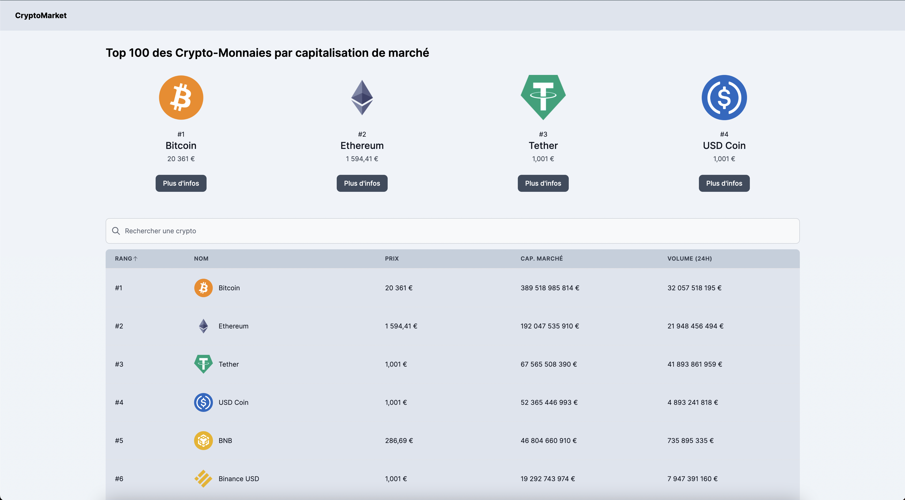
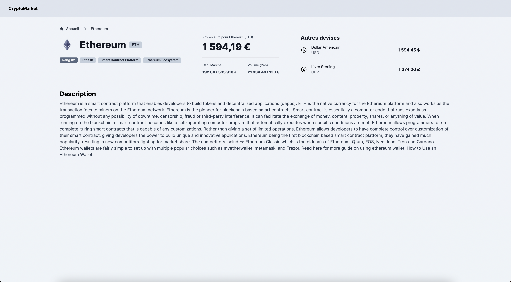

<h1 align="center">CryptoMarket</h1>

## À propos

CryptoMarket est une application web qui permet d'obtenir les informations des 100 meilleurs crypto-monnaies.
On peut y obtenir leurs noms, logo, prix actuels en euro, livre sterling et dollar US, capitalisation, volume et description.

## Stack Technique

La stack technique utilisée est TALL (Tailwind / AlpineJS / Laravel / Livewire)

Le preset est trouvable sur le site de **[TALL](https://tallstack.dev/)**

## Captures

## Idées d'améliorations futures

- Ajouter des graphiques en barres pour avoir un visuel sur le cours des monnaies sur les derniers jours
- Permettre à l'utilisateur de changer la devise du site
